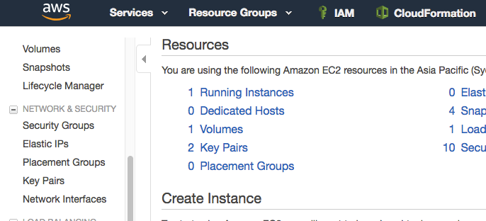
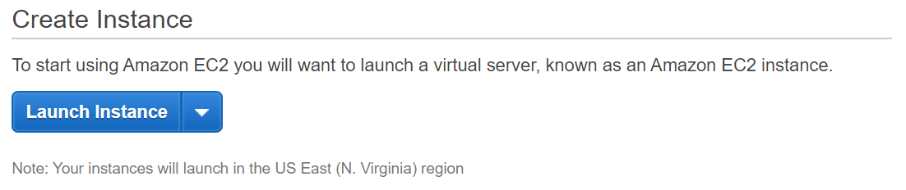
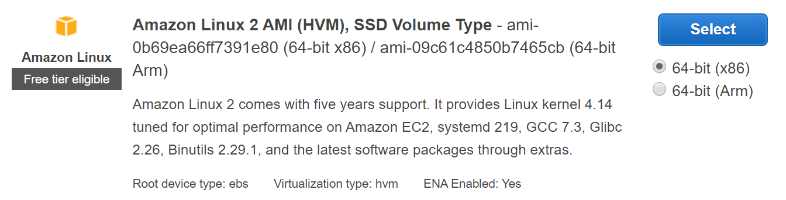
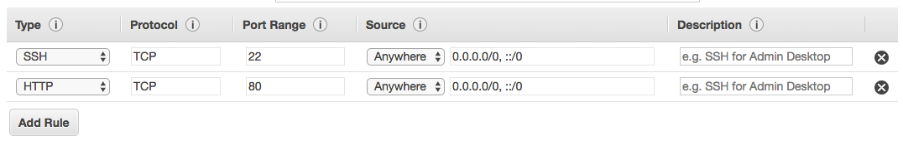

{width="1.629630358705162in"
height="1.2270581802274716in"}

AWS Immersion Day

EC2 Hands-On Lab

Getting Started with Linux on Amazon EC2

 

EC2 Overview
============

Amazon Elastic Compute Cloud (Amazon EC2) is a web service that provides
resizable compute capacity in the cloud. Amazon EC2's simple web service
interface allows you to obtain and configure capacity with minimal
friction. Amazon EC2 reduces the time required to obtain and boot new
server instances to minutes, allowing you to quickly scale capacity,
both up and down, as your computing requirements change. Amazon EC2
changes the economics of computing by allowing you to pay only for
capacity that you actually use.

This lab will walk you through launching, configuring, and customizing a
web server on Amazon EC2 using the AWS Management Console.

Create a new Key Pair
=====================

In this lab, you will create an EC2 instance as your web server. To
manage the instance, you need to be able to connect to it via SSH. The
following steps outline how to create a unique SSH keypair for this
purpose.

1.  Sign into the AWS Management Console and open the Amazon EC2 console
    at <https://console.aws.amazon.com/ec2>.

2.  In the upper-right corner of the AWS Management Console, confirm you
    are in the desired AWS region (e.g., N. Virginia).

3.  Click on **Key Pairs** in the NETWORK & SECURITY section near the
    bottom of the leftmost menu. This will display a page to manage your
    SSH key pairs.

{width="5.287129265091863in"
height="2.4046511373578303in"}

4.  To create a new SSH key pair, click the **Create Key Pair** button
    at the top of the browser window.

    {width="7.0in"
    height="1.91875in"}

5.  In the resulting pop up window, type *\[First Name\]-\[Last
    Name\]-ImmersionDay* into the **Key Pair Name:** text box and click
    **Create.\
    \
    **{width="3.5in"
    height="1.3334995625546806in"}**\
    **

6.  The page prompt you to download the file "*\[First Name\]-\[Last
    Name\]-ImmersionDay*.pem" to the local drive. Follow your browser
    instructions to save the file to the default download location.

7.  Remember the full path to this .pem file you just downloaded. This
    file contains your private key for future SSH connections.

Launch a Web Server Instance
============================

In this example, we will launch an Amazon Linux 2 instance, bootstrap
Apache/PHP, and install a basic web page that will display information
about our instance.

Sign into your AWS Management Console and choose EC2 from the Services
menu. [ ]{.underline}

8.  Click on Launch Instance

{width="7.1in" height="1.4916666666666667in"}

9.  In the **Quick Start** section, select the first Amazon Linux 2 AMI
    for 64-bit (x86) architecture and click **Select.** Note that the
    ami-xxxxxxxxx label and specific versions of the installed package
    may be different than in the image below.

{width="7.091666666666667in"
height="1.8083333333333333in"}

10. In the Step 2. *Choose an Instance Type*, select the **t2.micro**
    instance size and click **Next: Configure Instance Details**.

11. On Step 3. **Configure Instance Details** page, expand the
    **Advanced Details** section located at the bottom of the page,
    then, copy/paste the script below into the **User Data** field. This
    shell script will install Apache & PHP, start the web service, and
    deploy a simple web page. Click **Next: Add Storage.**

+---------------------------------------------------------+
| \#include                                               |
|                                                         |
| https://s3.amazonaws.com/immersionday-labs/bootstrap.sh |
+---------------------------------------------------------+

12. On this page you have the ability to modify or add storage and disk
    drives to the instance. For this lab, we will simply accept the
    storage defaults and click **Next: Add Tags.**

13. Here, you can choose a "friendly name" for your instance by clicking
    'Add Tag', and entering "Name" for the Key part and "\[Your Name\]
    Web Server" for the Value part. This Name key, more correctly known
    as a **tag**, will appear in the console once the instance launches.
    It makes it easy to keep track of running machines in a complex
    environment. Click **Next: Configure Security Group**.

14. You will be prompted to create a new security group, which will be
    your firewall rules. On the assumption that we are building out a
    Web server, name your new security group "\[Your Name\] Web Tier",
    and confirm an existing SSH rule exists which allows TCP port 22
    from Anywhere. Click **Add Rule.**

15. Add now another rule with HTTP from the 'Type' dropdown menu, and
    confirm TCP port 80 is allowed from Anywhere *(you'll notice, that
    "Anywhere is the same as '0.0.0.0/0')*. Click **Add Rule**.

{width="7.1in" height="1.1215277777777777in"}

16. Click the **Review and Launch** button after configuring the
    security group.

17. Review your cofiguration and choices, and then click **Launch**.

18. Select the key pair that you created in the beginning of this lab
    from the drop-down and check the \"I acknowledge\" checkbox. Then
    click the **Launch Instances** button. Your instance will now be
    starting, which may take a moment.

19. Click the **View Instances** button in the lower right hand portion
    of the screen to view the list of EC2 instances. Once your instance
    has launched, you will see your Web Server as well as the
    Availability Zone the instance is in, and the publicly routable DNS
    name.

20. Click the checkbox next to your web server to view details about
    this EC2 instance.

{width="6.988194444444445in"
height="4.58125in"}

Browse the Web Server
=====================

1.  Wait for the instance to pass the Status Checks to finish
    loading.{width="7.0in"
    height="0.6277777777777778in"}\
    Finished initializing\
    {width="7.0in"
    height="0.5465277777777777in"}

Open a new browser tab and browse the Web Server by entering the EC2
instance's Public DNS name into the browser. The EC2 instance's Public
DNS name can be found in the console by reviewing the "Public DNS" name
line highlighted above.\
\
You should see a website that looks like the following:

{width="4.790494313210849in"
height="1.6633661417322834in"}

Great Job! You have deployed a server and launched a web site in a matter of minutes!! 
--------------------------------------------------------------------------------------
