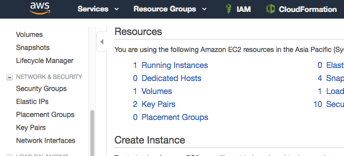
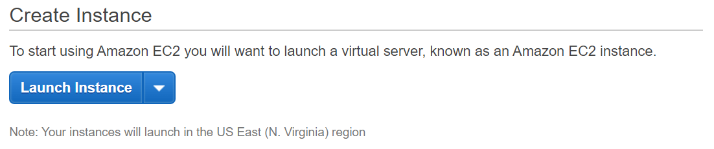
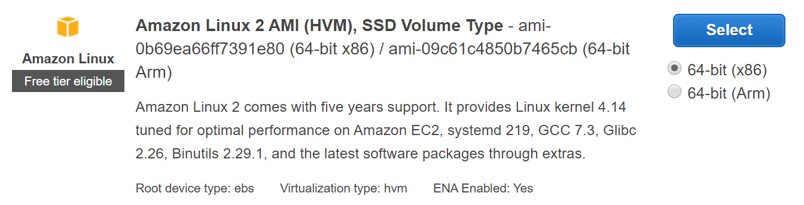
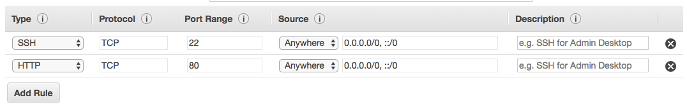

EC2 Overview
============

Amazon Elastic Compute Cloud (Amazon EC2) is a web service that provides
resizable compute capacity in the cloud. Amazon EC2's simple web service
interface allows you to obtain and configure capacity with minimal
friction. Amazon EC2 reduces the time required to obtain and boot new
server instances to minutes, allowing you to quickly scale capacity,
both up and down, as your computing requirements change. Amazon EC2
changes the economics of computing by allowing you to pay only for
capacity that you actually use.

This lab will walk you through launching, configuring, and customizing a
web server on Amazon EC2 using the AWS Management Console.

Task 1: Launch an Amazon EC2 Instance
=====================================
Create a new Key Pair
--------------------

In this lab, you will create an EC2 instance as your web server. To
manage the instance, you need to be able to connect to it via SSH. The
following steps outline how to create a unique SSH keypair for this
purpose.

1.  Sign into the AWS Management Console and open the Amazon EC2 console
    at <https://console.aws.amazon.com/ec2>.

2.  In the upper-right corner of the AWS Management Console, confirm you
    are in the desired AWS region (e.g., N. Virginia).
    
3.  Click on **Key Pairs** in the NETWORK & SECURITY section near the
    bottom of the leftmost menu. This will display a page to manage your
    SSH key pairs.

    

4.  To create a new SSH key pair, click the **Create Key Pair** button at the top of the browser window.

    

5.  In the resulting pop up window, type *\[First Name\]-\[Last Name\]-ImmersionDay* into the **Key Pair Name:** text box and click **Create.
    
    
    
6.  The page prompt you to download the file "*\[First Name\]-\[Last
    Name\]-ImmersionDay*.pem" to the local drive. Follow your browser
    instructions to save the file to the default download location.

7.  Remember the full path to this .pem file you just downloaded. This
    file contains your private key for future SSH connections.

Launch a Web Server Instance
----------------------------

In this example, we will launch an Amazon Linux 2 instance, bootstrap
Apache/PHP, and install a basic web page that will display information
about our instance.

Sign into your AWS Management Console and choose EC2 from the Services
menu.

8.  Click on Launch Instance



9.  In the **Quick Start** section, select the first Amazon Linux 2 AMI
    for 64-bit (x86) architecture and click **Select.** Note that the
    ami-xxxxxxxxx label and specific versions of the installed package
    may be different than in the image below.



10. In the Step 2. *Choose an Instance Type*, select the **t2.micro**
    instance size and click **Next: Configure Instance Details**.

11. On Step 3. **Configure Instance Details** page, expand the
    **Advanced Details** section located at the bottom of the page,
    then, copy/paste the script below into the **User Data** field. This
    shell script will install Apache & PHP, start the web service, and
    deploy a simple web page. 
    
```sh
#include https://s3.amazonaws.com/immersionday-labs/bootstrap.sh
```

   Click **Next: Add Storage.**

    
12. On this page you have the ability to modify or add storage and disk
    drives to the instance. For this lab, we will simply accept the
    storage defaults and click **Next: Add Tags.**

13. Here, you can choose a "friendly name" for your instance by clicking
    'Add Tag', and entering "Name" for the Key part and "\[Your Name\]
    Web Server" for the Value part. This Name key, more correctly known
    as a **tag**, will appear in the console once the instance launches.
    It makes it easy to keep track of running machines in a complex
    environment. Click **Next: Configure Security Group**.

14. You will be prompted to create a new security group, which will be
    your firewall rules. On the assumption that we are building out a
    Web server, name your new security group "\[Your Name\] Web Server",
    and confirm an existing SSH rule exists which allows TCP port 22
    from Anywhere. Click **Add Rule.**

15. Add now another rule with HTTP from the 'Type' dropdown menu, and
    confirm TCP port 80 is allowed from Anywhere *(you'll notice, that
    "Anywhere is the same as '0.0.0.0/0')*. Click **Add Rule**.



16. Click the **Review and Launch** button after configuring the
    security group.

17. Review your cofiguration and choices, and then click **Launch**.

18. Select the key pair that you created in the beginning of this lab
    from the drop-down and check the \"I acknowledge\" checkbox. Then
    click the **Launch Instances** button. Your instance will now be
    starting, which may take a moment.

19. Click the **View Instances** button in the lower right hand portion
    of the screen to view the list of EC2 instances. Once your instance
    has launched, you will see your Web Server as well as the
    Availability Zone the instance is in, and the publicly routable DNS
    name.

20. Click the checkbox next to your web server to view details about
    this EC2 instance.


Browse the Web Server
---------------------

1.  Wait for the instance to pass the Status Checks to finish
    loading.
    
    
    Finished initializing
    
    

Open a new browser tab and browse the Web Server by entering the EC2
instance's Public DNS name into the browser. The EC2 instance's Public
DNS name can be found in the console by reviewing the "Public DNS" name
line highlighted above.


You should see a website that looks like the following:


Great Job! You have deployed a server and launched a web site in a matter of minutes!! 
--------------------------------------------------------------------------------------

Task 2: Monitor Your Instance
=============================

Monitoring is an important part of maintaining the reliability, availability, and performance of your Amazon Elastic Compute Cloud (Amazon EC2) instances and your AWS solutions.

1. Click the **Status Checks** tab. With instance status monitoring, you can quickly determine whether Amazon EC2 has detected any problems that might prevent your instances from running applications. Amazon EC2 performs automated checks on every running EC2 instance to identify hardware and software issues.

Notice that both the System reachability and Instance reachability checks have passed.

2. Click the Monitoring tab. This tab displays CloudWatch metrics for your instance. Currently, there are not many metrics to display because the instance was recently launched.

You can click on a graph to see an expanded view.

Amazon EC2 sends metrics to Amazon CloudWatch for your EC2 instances. Basic (five-minute) monitoring is enabled by default. You can enable detailed (one-minute) monitoring.

3. In the **Actions**  menu, select **Instance Settings** > **Get System Log**.
The System Log displays the console output of the instance, which is a valuable tool for problem diagnosis. It is especially useful for troubleshooting kernel problems and service configuration issues that could cause an instance to terminate or become unreachable before its SSH daemon can be started. If you do not see a system log, wait several minutes and then try again.

4. Scroll through the output and note that the HTTP package was installed from the user data that you added when you created the instance.

5. Click **Close**

6. In the **Actions**  menu, select **Instance Settings** > **Get Instance Screenshot**. This shows you what your Amazon EC2 instance console would look like if a screen were attached to it.

7. Click **Close**

 Congratulations! You have explored several ways to monitor your instance
 -------------------------------------------------------------------------
 
Task 3: Resize Your Instance: Instance Type
===========================================

As your needs change, you might find that your instance is over-utilized (too small) or under-utilized (too large). If so, you can change the instance type. For example, if a t2.micro instance is too small for its workload, you can change it to an m5.medium instance. Similarly, you can change the size of a disk.

Stop Your Instance
------------------
Before you can resize an instance, you must stop it. When you stop an instance, it is shut down. There is no charge for a stopped EC2 instance, but the storage charge for attached Amazon EBS volumes remains.

1. On the EC2 Management Console, in the left navigation pane, click **Instances**. Web Server should already be selected.

2. In the **Actions**  menu, select **Instance State** > **Stop**.

3. Click **Yes, Stop**

    Your instance will perform a normal shutdown and then will stop running.

    Wait for the Instance State to display:  stopped
    
Change The Instance Type
------------------------

4. In the **Actions**  menu, select **Instance Settings** > **Change Instance Type**, then configure:
    
    Instance Type: t2.small

5. Click Apply
   When the instance is started again it will be a t2.small, which has twice as much memory as a t2.micro instance.

Start the Resized Instance
--------------------------
You will now start the instance again, which will now have more memory and more disk space.

6. In left navigation pane, click **Instances**.

7. In the **Actions**  menu, select **Instance State > Start**.

8. Click **Yes, Start**

Congratulations! You have successfully resized your Amazon EC2 Instance. In this task you changed your instance type from t2.micro to t2.small.
------------------------

[Optional] Task 4: Test Termination Protection
===================================

You can delete your instance when you no longer need it. This is referred to as terminating your instance. You cannot connect to or restart an instance after it has been terminated.

In this task, you will learn how to use termination protection.

1. In left navigation pane, click **Instances**. Select your **Web Server**

2. In the Actions  menu, select **Instance Settings > Change Termination Protection.**

3. Click **Yes, Enable**

    You can now try to terminate the instance.

4. In the **Actions**  menu, select **Instance State > Terminate.**

    Note that there is a message that says: These instances have Termination Protection and will not be terminated. Use the Change Termination Protection option from the Instances screen Actions menu to allow termination of these instances.

    Also, the Yes, Terminate button is dimmed and cannot be clicked.

    This is a safeguard to prevent the accidental termination of an instance. If you really want to terminate the instance, you will need to disable the termination protection.

Congratulations! You have successfully tested termination protection.
-------------------------------------------------------------------
