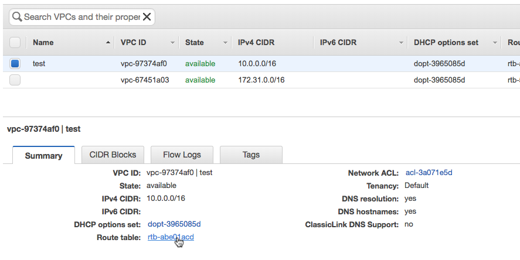

Virtual Private Cloud (VPC) Overview
====================================

Amazon Virtual Private Cloud (Amazon VPC) lets you provision a logically
isolated section of the AWS Cloud where you can launch AWS resources in
a virtual network that you define. You have complete control over your
virtual networking environment, including selection of your own IP
address range, creation of subnets, and configuration of route tables
and network gateways. You can use both IPv4 and IPv6 in your VPC for
secure and easy access to resources and applications.

In this lab, you will learn how to set up a VPC with public and private
subnets. You will also learn about AWS networking concepts such as
Elastic IPs, NAT Gateways, and Flow Logs.

Navigate to the VPC Dashboard
=============================

To get started, let's take a look at the VPC Dashboard.


In every region, a **default VPC** has already been created for you. So,
even if you haven't created anything in your account yet, you will see
some VPC resources already there.

In this lab, we will be using the **VPC Wizard** to create a VPC with
private and public subnets pre-configured. Once you're more familiar
with AWS networking, you can create VPCs and subnets without the Wizard
to create custom networking configurations.

During the VPC wizard set up, you will need to specify an **Elastic IP
Address (EIP)**. An Elastic IP is a static public IPv4 address that you
can attach to AWS resources, such as EC2 instances and NAT Gateways.
Elastic IPs are required for NAT Gateways.

1. To create one, go to **Elastic IPs** in the sidebar, and press
**Allocate new address**, **Allocate**, **Close.**


2. Now click on **VPC Dashboard** in the top left corner to go back to the
main VPC page.

3. Click on **Launch VPC Wizard** to start the VPC Wizard and select '**VPC
with Public and Private Subnets'**.


This option will create a VPC with a /16 CIDR block and two subnets with
/24 CIDR blocks which have 256 total IP addresses each. In each subnet,
**AWS reserves 5 IP addresses**. In this case, that leaves you 251 IP
addresses per subnet.

4. Fill in the **VPC name** (I called my VPC
"**test"**) and select your **Elastic IP Allocation ID** from the
drop-down. For this lab, we will leave the rest of the default
configuration as is.


This Elastic IP will be used to create a **Network Address Translation
(NAT) gateway** for the private subnet. NAT gateway is a managed, highly
scalable NAT service that gives your resources access to the internet
but doesn't allow anyone on the internet access to your resources. NAT
is helpful for when a resource needs to pull down updates from the
internet but should not be publicly accessible.

5. Click on **Create VPC**. This step will take a couple minutes. Once your
VPC has been created, click **OK**.

Wow! It only took you a few minutes to set up an entire virtual private
network, including subnets for public and private resources, routing
rules, and a scalable NAT service.

What the VPC Wizard Created
===========================

Let's walk through the VPC Console and explain each component that the
wizard created.

From the last step, you should now be on the **Your VPCs** dashboard
looking at all of your VPCs in this region.

6. Select the VPC that you just created, and look at the **Summary** tab. 

7. In the **Summary** tab in the left-hand column, you can see the **Main
Route Table** for your VPC. Any subnets in the VPC that do not have a
route table directly associated with it will use this route table by
default. To explore this further, click on the **Route table link**.



8. You are now in the **Route Tables** dashboard, filtered on the main
route table of the VPC you just created. That means that there should be
only one route table shown. Select this route table and click on the
**Subnet Associations** tab.


You can see that there are no **explicit subnet associations** on this
route table. However, since this is the main route table for the VPC,
there is one subnet implicitly associated. It's the **Private subnet**
of the VPC.

What makes a subnet public or private? We can find out by looking at the
routes in this table.

9. Click on the **Routes** tab.

In the **Routes** tab, look at the **Target** column. You'll see one
**local route** which every route table has. This ensures that resources
within the VPC can talk to each other.

You will also see a route to the **NAT gateway** that the wizard
created. Remember that a NAT gateway gives internet access to resources
which are not publicly accessible. Because the resources in this subnet
are not publicly accessible, this is considered a **private subnet**.

10. Now let's find out what makes a subnet public. First, get rid of the
filter on this view. To do this, **click the X in the search bar**. You
are now looking at all of the route tables in this region. Your
dashboard should look something like the screenshot below.

11. Select the other route table in your VPC (check **VPC** column for name)
which is not the main route table (check **Main** column for **No**). In
the **Routes** tab, you'll see a route to an **Internet Gateway (IGW)**.
IGWs are another managed and scalable service like the NAT Gateway
except that it allows access from the internet to your resources in the
VPC, making your resources publicly accessible.


There is a reason why this route table is not the main route table. It
is best practice for your VPC's main route table to not have a route to
an IGW so that subnets are private by default and only public if
specified.

12. Go to the **Subnet Associations** tab and confirm that it is the
**Public subnet** which is associated with this route table. Click on
the **Public subnet link**.

Look at the **Description** tab. You'll notice a **Network Access
Control List (Network ACL)** link. NACLs are virtual stateless firewalls
at the subnet layer. This wizard used the **default NACL** (created
automatically with the VPC) for both subnets. Similar to the main route
table, the default NACL is implicitly associated with all subnets in a
VPC unless another NACL is directly associated with that subnet.

13. Go to the **Network ACL** tab to look at the default NACL rules. Rules
are evaluated in order from lowest to highest. If the traffic doesn't
match any rules, the \* rule is applied, and the traffic is denied.
Default NACLs allow all inbound and outbound traffic, as shown below,
unless customized.


Allowing all traffic in and out of your subnets is not a good security
posture. However, it is possible to achieve good security with this
default NACL by leveraging **Security Groups** as well.

Security Groups are virtual stateful firewalls at the resource (EC2
instance) level. It is best practice to implement necessary firewall
rules with Security Groups first and only adding rules to NACLs as
necessary. For instance, you can explicitly deny traffic from specific
IPs with NACLs but not with Security Groups. We will explore Security
Groups more in the next section.

We have now gone through the bread and butter of AWS networking. You
should now understand how routing works in a VPC, what makes a subnet
public or private, and how to secure your resources at the subnet and
resource levels.

Create a Public EC2 Instance
============================

In this section, you will spin up an EC2 instance in the Public subnet
of your VPC.

To get started, go to the **Services** drop down menu in the top left
corner and go to the **EC2 dashboard**.

14.  Select Launch Instance, and then in the **Quick Start** section
    select the first Amazon Linux 2 AMI and click **Select.**

   

15.  In the Choose Instance Type tab, select the t2.micro instance size
    and click **Next**.

16.  On this page, you decide which network and subnet this resource will
    be put into. Change the **Network** field to the VPC that you just
    created and change the **Subnet** field to the **Public subnet**.
    Leave the other default settings as is. Click **Next**.


17.  For this lab, you can accept the default values in the remaining
    steps, so finish creating this instance by clicking on **Review and
    Launch.** You will see a warning that your security group is open to
    the world. You can ignore this warning and select **Launch**.

18.  In the pop-up window, select **Proceed without a key pair** from the
    drop-down and check the **acknowledgement** box. For this lab, you
    will not need to SSH into this instance. Click **Launch Instances**
    and then **View Instances**.

**Congratulations! You have just launched a virtual server in your
private network.**

Test Access to Public Instance
==============================

In this section, you will ping the EC2 instance that you just created
and learn more about security groups along the way.

You should be on the EC2 **Instances dashboard** from the last section,
looking at all of the EC2 instances in this region. If you just finished
the last section, your EC2 instance might still be spinning up. You can
tell by looking at the **Instance State** and **Status Checks** columns.
If you see **pending** state and/or status **Initializing**, the
instance is not ready yet.

19. While you're waiting for your instance to be ready, select the instance
to look at the **Description** tab. At the top of the right-hand column,
there is the information that we need to access the instance -- the IP
addresses and DNS records associated with the instance. However, you can
see that this instance doesn't have a public IP or DNS yet. We will need
at least one of these to ping this instance via the internet.


To fix this, we are going to attach an **Elastic IP** to the EC2
instance.

20. First, copy the **Instance ID** of this EC2 instance by
hovering your mouse to the right of the Instance ID line in the
**Description** tab, and clicking on the **Copy to clipboard** icon that
appears.

21. Next, click on **Elastic IPs** in the sidebar (under the **Network &
Security** section). Create a new Elastic IP as before, except this
time, **do not** click on the **Close** button. Instead, you will:
**Allocate new address, Allocate**, and then click on the **Elastic IP**
link in the **New address request succeeded** box.


Now you are back on the **Elastic IPs** dashboard. 

22. Go to the **Actions**
dropdown and select **Associate address**. Paste the Instance ID that
you copied previously into the **Instance** box and click on
**Associate**, then **Close**.

Now that an Elastic IP is attached to the EC2 instance, we should be
able to ping the instance over the internet. It now has a public IP
address from the Elastic IP, and it's in the public subnet which has a
route to an IGW.

23. In the **Description** tab, copy the Elastic IP address.


24. Open your CLI. On Windows, open the **Command Prompt**. On Mac, open the **Terminal**. Type:

``` sh 
ping <your-elastic-IP>
```
If the instance is reachable, we expect to see lines appearing such as

64 bytes from 13.237.153.185: icmp\_seq=0 ttl=238 time=169.294 ms

However, you will see request timeouts instead. You will see lines that
say something similar to

Request timed out.

*Why aren't we able to reach this instance?*

You can confirm that the instance is in the public subnet and check the
route table associated with that subnet to make sure there is a route to
the IGW.

Next, let's check our virtual firewall configurations. As you remember,
we left the NACL of the public subnet as is, which allows all traffic by
default. So, let's check the security group associated with this
instance.

25. In the **EC2 dashboard**, go to the **Instances** section in the
sidebar. Select the instance that you created and look at the
**Description** tab. In the left column, click on the first **Security
groups** link. It should be called something similar to
**launch-wizard-1**.


26. You are now in the **Security Groups** dashboard. Go to the **Inbound**
tab.

Remember when we were creating the EC2 instance we only specified the
AMI, instance type, and VPC subnet. We left all the other default
settings as is. One of these default settings created this security
group, which allows all inbound access on SSH port 22.

27. Pings use **ICMP**, so we will need to change the security group rule to
allow ICMP traffic rather than SSH traffic. Click on the **Edit**
button.


28. Click on **SSH** to open the drop-down and change it to **All** **ICMP -
IPv4**. Click **Save**.

Since security groups are stateful, you don't need to edit the outbound
rules. The security group will allow the instance to respond to the ping
since it saw the ping arrive at the instance. This change will also take
effect immediately, so we can try to ping the instance again right away.

29. Go back to your CLI and hit the **up arrow** and then **enter** to try
and ping the instance again.


**Good job! You have successfully troubleshooted why an EC2 instance was
unreachable and then accessed it over the internet.**

Test Access to Private Instance
===============================

Optionally, you can go through the same process in the last two sections
in order to test access to a private EC2 instance. The only difference
will be in the **Configure Instance Details** section, you will select
the **Private subnet**. Also, if you don't want to go through attaching
an Elastic IP, in the same section, you can select **Enable** under
**Auto-assign Public IP**. Remember that this is not best practice for
public facing resources, but in this case the instance will not be
reachable anyways because the private subnet does not have an IGW route.
We just want a public IP to try to access, and for this, the
automatically assigned public IP is sufficient. Additionally, you will
want to open up your security group from the beginning. That way, this
private instance will be the same in every way to the public instance
you just created except that it does not have a route to an IGW and thus
cannot be accessed publicly.

Clean Up Lab Resources
======================

If you want to clean up your account to get rid of everything we created
during this lab, follow the instructions in this section. You can also
leave your lab environment running if you want to test other AWS
networking concepts.

First, you will need to terminate the EC2 instances that are running in
the VPC. In the **EC2 dashboard**, select the public instance (as well
as the private instance if you created one), go to the **Actions**
dropdown, go to **Instance State**, and then **Terminate**. In the
pop-up window, click on **Yes, Terminate.** You may need to wait a
minute for the instances to finish shutting down. Watch the **Instance
State** column and wait for the status to change from **shutting-down**
to **terminated**.

Now we will delete the NAT gateway that the VPC wizard created. Go to
the **Services** dropdown in the top left corner and select the **VPC**
**dashboard**. Go to the **NAT Gateways** section in the sidebar. If
there are multiple NAT Gateways, you can look at the VPC column to
confirm which one belongs to your VPC. Select that NAT gateway and go to
the **Actions** dropdown. Select **Delete NAT Gateway**. In the pop-up
window, click on **Delete NAT Gateway** again. It may take a minute for
the NAT gateway to delete. Wait for the status to change from
**deleting** to **deleted** to make sure the VPC deletion will work.

Elastic IP addresses are completely free as long a they are attached to
a resource. However, if the NAT gateway or EC2 instance they were
attached to is terminated or deleted, the unattached EIP will incur a
small monthly charge. To clean up, navigate to Elastic IPs on the
sidebar, and Release each EIP you have allocated.

Now you can finally delete your VPC. Go to the **Your VPCs** section in
the sidebar. Select your VPC, go the **Actions** dropdown, and choose
**Delete VPC**. In the pop-up window, click **Yes, Delete**. This will
take a minute or so to complete.

Additional Resources
====================

VPC Introduction:
<https://docs.aws.amazon.com/AmazonVPC/latest/UserGuide/VPC_Introduction.html>

VPC Subnets:
<https://docs.aws.amazon.com/AmazonVPC/latest/UserGuide/VPC_Subnets.html>

VPC wizard configuration:
<https://docs.aws.amazon.com/AmazonVPC/latest/UserGuide/VPC_Scenario2.html>

NAT Gateways:
<https://docs.aws.amazon.com/AmazonVPC/latest/UserGuide/vpc-nat-gateway.html>

Elastic IPs:
<https://docs.aws.amazon.com/AmazonVPC/latest/UserGuide/vpc-eips.html>

Security Groups and NACLs:
<https://docs.aws.amazon.com/AmazonVPC/latest/UserGuide/VPC_Security.html>
