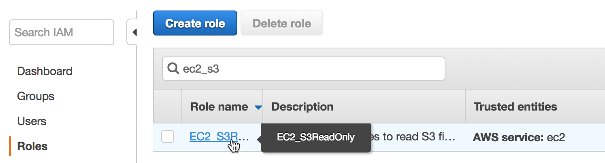
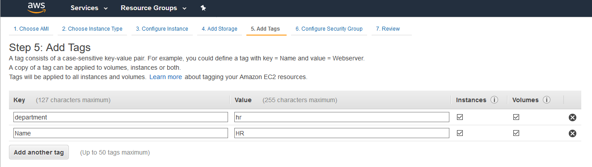

Identity & Access Management (IAM) Overview
===========================================

AWS Identity and Access Management (IAM) is a free service that enables
you to manage access to AWS services and resources securely. Using IAM,
you can create and manage AWS users and groups, and use permissions to
allow and deny their access to AWS resources.  This introductory lab is
broken into the following parts:

-   **Part One**: You will create two customer-managed IAM policies.

-   **Part Two:** You will create four AWS IAM users.

-   **Part Three**: You will create one AWS IAM group.

-   **Part Four**: You will create two AWS IAM roles.

-   **Part Five:** You will test the access your configuration has
    provided.

-   **Part Six**: You will cleanup resources configured in the lab
    environment.

Part One: Create AWS IAM Identity Policies
==========================================

You manage access in AWS by creating policies and attaching them to IAM
entities (users, groups of users, or roles) or AWS resources. A policy
is an object in AWS that, when associated with an identity or resource,
defines their permissions. AWS evaluates these policies when a Principal
entity (user or role) makes a request.

Identity-based policies are [JSON](https://www.json.org/) (Java Script
Object Notation) permissions policy documents that you can attach to an
identity (user, group of users, or role) to manage access. A JSON policy
document includes these elements:

-   Optional policy-wide information at the top of the document

-   One or more individual statements

Each statement in a policy includes information about a single
permission. If a policy includes multiple statements, AWS applies a
logical OR across the statements when evaluating them.


The information in a statement is contained within a series of elements.

1.  Version -- Specify the version of the policy language that you want
    to use.

2.  Statement -- Container for the following elements:

    -   Sid -- Include an optional statement ID to differentiate between
        your statements.

    -   Effect -- Use Allow or Deny indicating whether the policy allows
        or denies access.

    -   Principal -- We will NOT use this element in this lab. The
        Principal element is used in resource policy statements to
        identify the Principal (account, user, role, or federated user)
        to which you would like to allow or deny access. This element is
        NOT used when creating IAM identity policies. In IAM identity
        policies the Principal is implied from the user or role that the
        policy is attached to.

    -   Action -- Include a list of actions that the policy allows or
        denies.

    -   Resource -- Specify a list of resources to which the actions
        apply.

    -   Condition (Optional) -- Specify the circumstances under which
        the policy grants permission.

If you want to define more than one permission for an entity (user,
group, or role), you can use multiple statements in a single policy. You
can also attach multiple policies to an IAM entity to manage access. For
example, the example below has two permission statements included in the policy
that enable all DynamoDB actions against two tables located us-east-1
and us-west-2 regions in the AWS Account 123456789012.

Example IAM Identity Policy:

```sh
{
    "Version": "2012-10-17",
    "Statement": [
    {
     "Effect": "Allow",
     "Action": "dynamodb:*",
     "Resource": [ "arn:aws:dynamodb:us-east-1:123456789012:table/MyTestApp_DDB_Table" ]
    },
    {
     "Effect": "Allow",
     "Action": "dynamodb:*",
     "Resource": [ "arn:aws:dynamodb:us-west-2:123456789012:table/MyTestApp_DDB_Table" ]
    }
    ]
}

```

We will now create an AWS IAM identity policies using the AWS console.

1.  Log into the AWS account you plan to use for this lab. Ensure that
    you authenticate using an identity which has been granted
    Administrative access in the AWS account. It is recommended that you
    use an identity that has the AdministratorAccess policy
    (arn:aws:iam::aws:policy/AdministratorAccess) attached.

2.  Access the AWS IAM console
    (<https://console.aws.amazon.com/iam/home#/home>) and select
    Policies from the sidebar or go to
    <https://console.aws.amazon.com/iam/home?region=us-east-1#/policies>.
    Click Create Policy. On the "Create Policy" screen, select the JSON
    tab and paste the policy contents from figure 2 below into the JSON
    text editing panel in the AWS console.

The policy has 3 statements. When attached to an IAM entity these
statements:

-   Allow the Principal (e.g. User) to execute all Elastic Compute Cloud
    (EC2) actions against EC2 instances which have the same department
    tag as the Principal attempting to perform the action.

-   Allow the Principal (e.g. User) to describe all EC2 instances within
    the AWS account.

-   Explicitly deny the Principal (e.g. User) access to manipulate IAM
    or EC2 tags within the AWS account.

Example 2: The departmental-ec2-access policy

```sh
{
    "Version": "2012-10-17",
    "Statement": [
        {
            "Sid": "AllowDepartmentEC2Management",
            "Effect": "Allow",
            "Action": "ec2:*",
            "Resource": "*",
            "Condition": {
                "StringEquals": {
                    "ec2:ResourceTag/department": "${aws:PrincipalTag/department}"
                }
            }
        },
        {
            "Sid": "AllowEC2DescribeAll",
            "Effect": "Allow",
            "Action": "ec2:Describe*",
            "Resource": "*"
        },
        {
            "Sid": "DenyTagManagement",
            "Effect": "Deny",
            "Action": [
                "iam:UntagUser",
                "iam:UntagRole",
                "ec2:DeleteTags",
                "ec2:CreateTags",
                "iam:TagRole",
                "iam:TagUser"
            ],
            "Resource": "*"
        }
    ]
}

```


Note: aws:PrincipalTag is an [AWS Global Condition Context
Key](https://docs.aws.amazon.com/IAM/latest/UserGuide/reference_policies_condition-keys.html).
AWS provides context keys which can be used in IAM policies to restrict
access. In this IAM policy, we use it to check that the tag attached to
the IAM Principal (e.g. User) making the request. This policy uses the
StringEquals operator to compare the value of the department key
attached to the IAM Principal with the department key of the EC2
resource they are attempting to access using the Amazon EC2
ec2:ResourceTag condition key.

3.  After pasting the policy from figure 2 into the JSON editor in the
    AWS Console. Click "Review policy".


4.  Name the policy "departmental-ec2-access" and optionally, add a
    description. Click "Create policy".


5.  Policy creation is confirmed as you are returned the IAM console
    policy dashboard.

6.  Repeat steps 1 through 5 to create a second policy. Name the policy
    "contractorsroleassumptionpolicy". On the create policy screen, use
    the policy provided in Figure 3. This policy allows the assumption
    of an IAM Role if the condition is met that the role has a tag with
    a key of contractorsassumerole and a value of true.

Figure 3. The contractorsassumerole policy

```sh
{
  "Version": "2012-10-17",
  "Statement": {
    "Effect": "Allow",
    "Action": "sts:AssumeRole",
    "Resource": "*",
    "Condition": {"StringLike": {"iam:ResourceTag/contractorsassumerole": "true"}}
  }
}
```

**Congratulations! You have created two IAM Identity** **policies**.
These policies are customer-managed policies. Customer managed policies
are standalone identity--based policies that you create and which you
can attach to multiple IAM users, groups, or roles in your AWS account.

Part Two: Create IAM Users
==========================

1.  Access the AWS IAM console and select Users from the sidebar or go
    to
    <https://console.aws.amazon.com/iam/home?region=us-east-1#/users>.
    Click Create User.

2.  On the "Add user" screen, under "Set User Details" enter "Anne" in
    the User name field

3.  On the "Add user" screen, under "Select AWS access type", check the
    checkbox to enable AWS Management Console access. Do not enable
    programmatic access. Under "Console password" select the Custom
    password radio button and enter a password in the text box -- make a
    note of this password since it will be needed to later to test the
    security configuration. Ensure the "Require password reset" checkbox
    is unchecked. Click "Next: Permissions".


4.  On the "Set permissions" screen, select the "Attach existing
    policies directly" option and use the filter search to locate the
    Identity policy created in part one of this lab. Select the checkbox
    next to the policy to select it. Click "Next: Tags".


5.  On the "Add Tags" screen, add a tag with the Key "department" and a
    Value of "hr".


6.  On the "Review" screen, review your choices. Click "Create Users"

7.  On the final "Add user" screen, verify that user was successfully
    created. Click Close.

8.  Repeat Lab Part Two steps 1 through 7 to create the user "Sally". On
    step 2 enter "Sally" in the User name field. On step 3, provide the
    Sally with the same permissions as Anne. On step 4, when adding a
    tag to the user Sally, the tag should have the key "department" and
    a value of "finance" as seen below.


9.  Repeat Lab Part Two steps 1 through 7 to create the user "John". On
    step 2 enter "John" in the User name field. On step 3, DO NOT
    provide any permissions. On step 4, do not add any tags to the user
    John.

10. Repeat Lab Part Two steps 1 through 7 to create the user "Bob". On
    step 2 enter "Bob" in the User name field. On step 3, DO NOT provide
    any permissions. On step 4, do not add any tags to the user Bob.

**Congratulations! You have created four IAM users. The users are named
Anne, Sally, John and Bob.**

-   Anne has the permission policy "department-ec2-access" attached to
    her identity. Anne has a tag with a key of "department" and a value
    of "hr" attached to her identity.

-   Sally has the permission policy "department-ec2-access" attached to
    her identity. Sally has a tag with a key of "department" and a value
    of "finance" attached to her identity.

-   John has no permission policy attached to his identity. John has no
    tags attached to his identity.

-   Bob has no permission policy attached to his identity. Bob has no
    tags attached to his identity.

Part Three: Create an IAM Group
===============================

An IAM group is a collection of users. Groups are often based on job
function and can be used to simplify provisioning common user access
requirements. They allow you to manage permissions by applying policies
to groups of users, rather than applying policies to each individual
user.

1.  Access the AWS IAM console and select Groups from the sidebar or go
    to https://console.aws.amazon.com/iam/home?region=us-east-1#/groups.
    Click **Create New Group**.

2.  Type in Contractors as the Group Name. Go to the Next Step.

3.  On the Attach Policy screen, enter the search string "S3" in the
    search bar and check the checkbox next to the AWS managed policy
    titled "AmazonS3ReadOnlyAccess".

4.  On the same Attach Policy screen execute a second search. Enter the
    search string "contractors" for a and add the customer-managed
    policy named "contractorsroleassumptionpolicy". Policies are what
    give IAM entities permissions. AWS provides managed policies for
    many common access needs. We will use the AmazonS3ReadOnlyAccess
    which will provide read only access to the Amazon Simple Storage
    Service (S3) to all members of the Contractors group. Click Next
    Step.


5.  On the review screen, click Create Group.

6.  The group is created, and you are returned to the Group creation IAM
    console. Select the Contractors group and chose "Add Users to Group"
    from the Group Actions Menu Dropdown.

7.  Add the users named John and Bob to the Contractors group. Check the
    checkbox next to their names and Click "Add Users". The IAM groups
    dashboard will now show the Contractors group has 2 users.


**Congratulations!** You have created an IAM Group and attached the AWS
managed policy AmazonS3ReadOnlyAccess which provides read only access to
Amazon Simple Storage Service (S3) to members of this group. You added
the customer managed policy named "contractorsroleassumptionpolicy"
which will allow members of this group to assume roles which have been
tagged with a Key of contractorsassumerole and a Value of true. You
added the IAM users John and Bob into the Contractors group.

Part Four: Create IAM Roles
===========================

IAM Roles can be assumed by AWS services, IAM users, or applications.
They are assigned temporary rather than permanent credentials whenever
assumed. Using roles for privileged permissions sets can help improve
your security posture since credential exposure is minimized.

1.  Access the AWS IAM console and select Roles from the sidebar or go
    to <https://console.aws.amazon.com/iam/home?region=us-east-1#/roles>

2.  On the **Select type of trusted identity** page, you decide who or
    what will be able to assume this role. For this lab, we will create
    a role that allows an EC2 instance to read files in S3. Therefore,
    we will stay on the **AWS service** tab and select **EC2**. Go to
    **Next: Permissions**.


3.  Attach a managed policy with S3 Read Only access to the role by
    typing **s3** into the search bar, and then selecting the
    **AmazonS3ReadOnlyAccess** policy. Go to the **Next: Review**.


4.  Give your role a descriptive name, such as **EC2\_S3ReadOnly** and
    edit the **role description** to be a helpful summary of what this
    role is. When you're done, **Create Role**.

5.  You are now back on the **Roles** page. Enter the name of the role
    you just created into the search bar and click on the role name.



6.  You are now on the **Summary** page of the role you just created.
    Here you can view and edit attributes of the role, such as how long
    the role's temporary credentials last. The default value as you can
    see below is 1 hour but can be up to 12 hours. Click on the Trust
    relationships tab and you will see that ec2.amazonaws.com is listed
    as a trusted entity that can assume this role.

> 

**Congratulations!** You've just created an IAM role which will allow
EC2 instances in your account to assume this role and read objects in
S3. We will now create a role which can be assumed by an IAM user in
your account.

7.  Access the AWS IAM console and select Roles from the sidebar or go
    to <https://console.aws.amazon.com/iam/home?region=us-east-1#/roles>

8.  On the **Select type of trusted identity** page, select "Another AWS
    Account". Cross account role assumption is a method to provide
    privileged access to identities across multiple AWS accounts. For
    the purposes of this lab we will demonstrate role assumption within
    one AWS account. We will create a role that we will allow IAM users
    to switch to this role from within the same account. In the Account
    ID text box, enter the Account ID of the AWS account that you are
    currently logged into. For the purposes of this lab, leave both
    options (require external ID, require MFA) unchecked. Go to **Next:
    Permissions**.


9.  Under the Attach permissions policies screen, use the text box to
    perform a filtered search for the AmazonEC2FullAccess policy. Check
    the check box to select this policy and attach it to the role being
    created. Click "Next: Tags".

> 
10. On the "Add Tags" screen, add a tag with the Key
    "contractorsassumerole" and a Value of "true". Click "Next Review".
    On the review screen name the role "ec2poweruser". Click create
    role.


11. The role is created successfully. Access the ec2poweruser role
    details page by searching for role by name from the Roles dashboard
    or by accessing
    <https://console.aws.amazon.com/iam/home?#/roles/ec2poweruser>

12. Confirm that AmazonEC2FullAccess is listed under attached policies
    and copy the switch roles console link from your IAM dashboard
    (example link location underlined in red in the image below). **Copy
    into a text editor for safekeeping. You will need this URL in Part
    Five of this lab to test access**.


Part Five: Test Access
======================

Figure 4. Provisioned IAM Configurations


We can summarize the existing configurations we have completed in this
lab as follows:

-   A customer managed IAM identity policy named
    departmental-ec2-access.

-   A customer managed IAM identity policy named
    contractorsroleassumptionpolicy.

-   A user named Anne, who has a tag with the key of department and the
    value of hr. Anne has the departmental-ec2-access policy attached to
    her identity.

-   A user named Sally, who has a tag with the key of department and the
    value of finance. Sally has the departmental-ec2-access policy
    attached to her identity.

-   A user named John.

-   A user named Bob.

-   An IAM Group named Contractors which has the AWS Managed policy
    named AmazonS3ReadOnlyAccess attached to the group. John and Bob are
    members of the group.

-   A role named **EC2\_S3ReadOnly** (which has a trust policy making
    the role assumable by an EC2 instance) that has the Amazon managed
    policy named **AmazonS3ReadOnlyAccess** attached to the role.

-   A role named **ec2poweruser** (which has a trust policy making the
    role assumable by IAM entities within this AWS account) that has the
    Amazon managed policy named **AmazonEC2FullAccess** attached to the
    role. The role has a tag with the Key of contractorsassumerole and
    the Value of true

We have used both AWS and Customer managed policies. We have attached
policies to IAM users, IAM Roles and Groups of IAM users. We have tagged
IAM Users Anne and Sally. We have tagged the ec2poweruser IAM Role. It
Is not possible to tag a Group of users. In the next part of this lab,
we will test the access provided.

1.  Ensure that you are still logged into your AWS account using an
    identity which has been granted Administrative access in the AWS
    account. It is recommended that you use an identity that has the
    AdministratorAccess policy
    (arn:aws:iam::aws:policy/AdministratorAccess) attached. Access the
    EC2 Console at
    <https://console.aws.amazon.com/ec2/v2/home?region=us-east-1#Home>:

    Click the Launch instances blue button. The EC2 Launch wizard screen
    loads. On "Step 1: Choose an Amazon Machine Image (AMI)" page,
    select an Amazon Linux 2 AMI


2.  On "Step 2: Choose an Instance Type", select a t2.micro or t2.nano
    EC2 instance type. Click "Next: Configure Instance Details".


3.  On "Step 3: Configure Instance Details", choose an appropriate VPC
    and subnet within your account to launch your EC2 instance. Note:
    Neither SSH inbound to, or outbound Internet access from the EC2
    instance are required during this lab. Click "Next: Add Storage".


4.  On "Step 4: Add Storage", accept the default storage size allocated
    to your EC2 instance.

5.  Click "Step 5: Add Tags". Add two tags. The first tag should have
    the key "department" and a value of "hr". The second tag should have
    the key "Name" and a value of "HR". **Attention -- these values are
    case sensitive !!** Click "Next Configure Security Group"



7.  On "Step 6: Configure Security Group", create a new security group
    with a name and description of "resource-tagging-lab". Remove all
    inbound rules to the EC2 instance that are defined in the security
    group. Click "Review and Launch"

> 
8.  On "Step 7: Review Instance Launch", review/validate your
    configurations. Click Launch. You will be prompted by the "Select an
    Existing Key Pair or Create a New Key Pair" prompt. Choose "Proceed
    without keypair" from the dropdown menu bar in the prompt and tick
    the checkbox to acknowledge that you will not be able to connect to
    the provisioned EC2 instance. Operating system access is not
    required for this lab.

9.  **Repeat steps 2a through 2h** to provision a second EC2 instance in
    your AWS account to provision an EC2 instance for the FINANCE
    department. When completing steps 2a through 2h for a second time,
    change the tag values provided in step f. When creating the FINANCE
    EC2 instance, the first tag should have the key "department" and a
    value of "finance". The second tag should have the key "Name" and a
    value of "FINANCE". **Please treat these values as case sensitive
    !!**

10. Test Anne's access and ability to administer resources for the hr
    department

    a.  Return to the AWS IAM console
        (<https://console.aws.amazon.com/iam/home#/home>). **Make note
        of the IAM users sign-in link immediately underneath the welcome
        banner (see example screenshot below).** You will use this to
        sign in using the IAM User identities we have created in this
        lab (Anne, Sally and John) to validate their access. **Copy the
        IAM users sign-in link into a text editor for safekeeping.** It
        should be of the format

https://**youraccountID-or-alias**.signin.aws.amazon.com/console


b.  **Log out of the AWS console**. Log in as Anne using the IAM users
    sign-in link you collected from the IAM Console. Specify the IAM
    user Anne as the User and use the password your specified earlier
    when creating the user Anne.

11. Continue testing Anne's access. Access the EC2 console
    (<https://console.aws.amazon.com/ec2/v2/home?region=us-east-1#Instances:sort=instanceState>
    ). Select the checkbox for the EC2 instance named FINANCE. Using the
    Actions menu, attempt to Terminate the EC2 instance named "FINANCE"
    by selecting STOP under the Instance State menu option. The
    operation will fail because the department tag value attached to the
    EC2 instance does not match the department tag value attached to the
    Principal (Anne). The condition in the statement titled
    "**AllowDepartmentEC2Management"** in the departmental-ec2-access
    policy is not met and the request fails. Attempt the same operation
    after deselecting the EC2 instance named "FINANCE" and selecting the
    instance named "HR". The operation will succeed because the
    condition in the policy statement is met and the action is allowed.
    **Log out of the AWS Console**.


12. Test Sally's access and ability to administer resources for the
    finance department.

    a.  Log in as Anne using the IAM users sign-in link you collected
        from the IAM Console. Specify the IAM user Sally as the User and
        use the password your specified earlier when creating the user
        Sally.

    b.  Access the EC2 console
        (<https://console.aws.amazon.com/ec2/v2/home?region=us-east-1#Instances:sort=instanceState>
        ). Attempt to Stop the EC2 instance named "FINANCE". The
        operation will succeed. Do not terminate the EC2 instance named
        "FINANCE". **Log out of the AWS Console**.

**Congratulations !!** You have validated access for Anne and Sally to
departmental EC2 resources based on tag key and tag values.

13. Test John's ability to access S3 as a result of his membership to
    the contractors group.

    a.  Log in as John using the IAM users sign-in link you collected
        from the IAM Console. Specify the IAM user John as the User and
        use the password your specified earlier when creating the user
        John.


b.  Access the S3 console
    ([https://s3.console.aws.amazon.com/s3/home?region=us-east-1\#](https://s3.console.aws.amazon.com/s3/home?region=us-east-1)).
    The operation will succeed. Attempt to create a new S3 bucket. The
    operation will fail. John has been provided read only access to S3
    via his membership of the Contractors IAM group.
    
14. Test John's ability to assume the ec2poweruser role given his
    "assumerole" tag with a value of "true"

    a.  While still logged in as the IAM user John, use the link
        captured in part four step 12 of this lab to switch roles to
        ec2poweruser role. Paste the link or type in a browser. It
        should be of the format

https://signin.aws.amazon.com/switchrole?roleName=ec2poweruser&account=**youraccountID-or-alias**

Alternatively, use the switch role option under the user menu in the
primary AWS console


Provide your AccountID or account alias, the role name and a display
value and color. Click Switch role.


Having assumed the ec2poweruser role, proceed to the EC2 console and
terminate the remaining EC2 instance named "FINANCE". The operation
will succeed. Access the S3 console. The operation will fail. You do
not have access to the S3 console. This is because the permissions of
your IAM user (e.g. John) and any roles that you switch to (e.g.
ec2poweruser) are not cumulative. John has S3 read access as a result
of his membership to the Contractors IAM Group. The ec2poweruser role
has access to EC2 but no access to S3. Only one set of permissions is
active at a time. When you switch to a role, you temporarily give up
your user permissions and work with the permissions that are assigned
to the role. When you exit the role, your user permissions are
automatically restored.

**Congratulations !!** You have validated the IAM user John has read
only access to S3 and validated his ability to assume the ec2poweruser
role with its associated permissions. You observed how permissions are
not cumulative with role assumption. You used the ec2poweruser role to
clean up EC2 resources provisioned to test IAM user access in the lab.

Part Six: Clean up Lab Resources
================================

We will now cleanup the remaining resources provisioned for this lab.
Log into the AWS account you used for this lab. Ensure that you
authenticate using an identity which has been granted Administrative
access in the AWS account. It is recommended that you use an identity
that has the AdministratorAccess policy
(arn:aws:iam::aws:policy/AdministratorAccess) attached.

1.  Access the AWS IAM console
    (<https://console.aws.amazon.com/iam/home#/home>) and select
    Policies from the sidebar or go to
    <https://console.aws.amazon.com/iam/home?region=us-east-1#/policies>.
    Use the search bar to search for the Policy you created in Part One.
    Select the radio button next to the Policy you created (named
    departmental-ec2-access) and then select "Delete" from the Policy
    Actions dropdown menu. Accept confirmations to delete the IAM
    Policy.

2.  Access the AWS IAM console and select Users from the sidebar or go
    to
    <https://console.aws.amazon.com/iam/home?region=us-east-1#/users>.
    For each user created in this lab (Anne, Sally, John), select the
    checkmark next to their username and then click "Delete User".
    Accept confirmations to delete the IAM user identities.

3.  Access the AWS IAM console and select Groups from the sidebar or go
    to
    [**https://console.aws.amazon.com/iam/home?region=us-east-1\#/groups**](https://console.aws.amazon.com/iam/home?region=us-east-1#/groups).
    Check the checkmark next to the group named Contractors and then
    select "Delete Group" from the Group Actions dropdown menu. Accept
    confirmations to delete the IAM Group.

4.  Access the AWS IAM console and select Roles from the sidebar or go
    to
    <https://console.aws.amazon.com/iam/home?region=us-east-1#/roles>.
    Use the search bar to search for the Role you created in Part One.
    Check the checkmark next to the Role named **EC2\_S3ReadOnly** and
    then click "Delete Role". Accept confirmations to delete the IAM
    Role.

5.  Access the EC2 console
    (<https://console.aws.amazon.com/ec2/v2/home?region=us-east-1#Instances:sort=instanceState>
    ). Validate that the instances named HR and Finance have been
    terminated successfully.

Additional Resources
====================

IAM Introduction:
<https://docs.aws.amazon.com/IAM/latest/UserGuide/introduction.html>

IAM Best Practices:
<https://docs.aws.amazon.com/IAM/latest/UserGuide/best-practices.html>

IAM Policies:
<https://docs.aws.amazon.com/IAM/latest/UserGuide/access_policies.html>

IAM Tutorials:
<https://docs.aws.amazon.com/IAM/latest/UserGuide/tutorials.html>
